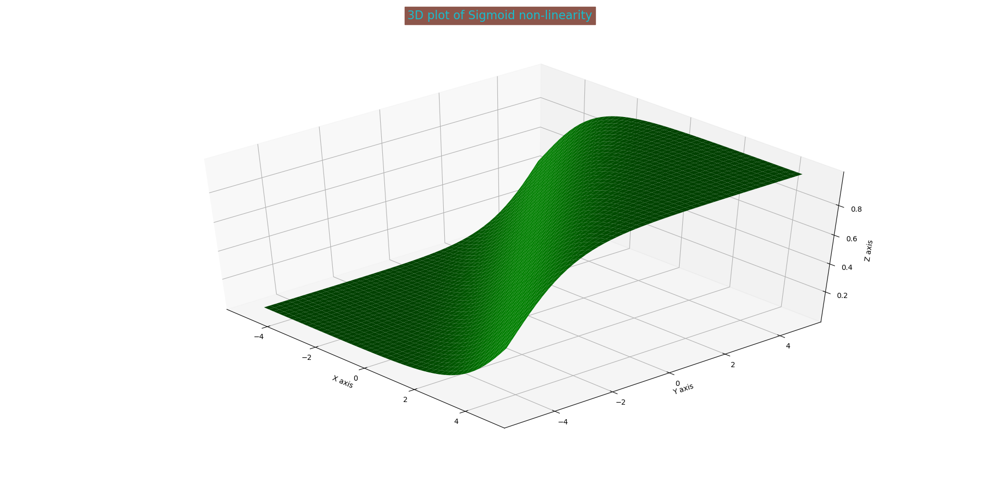
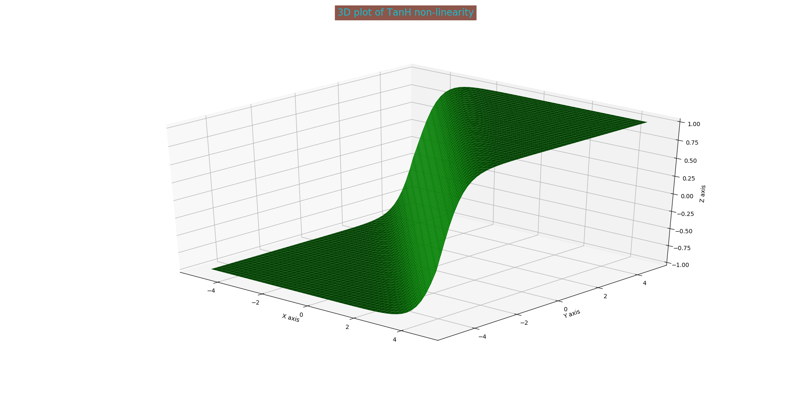
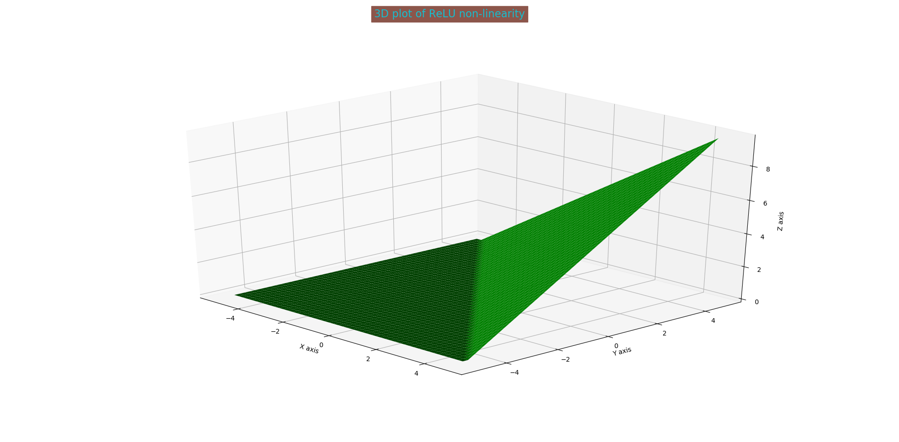
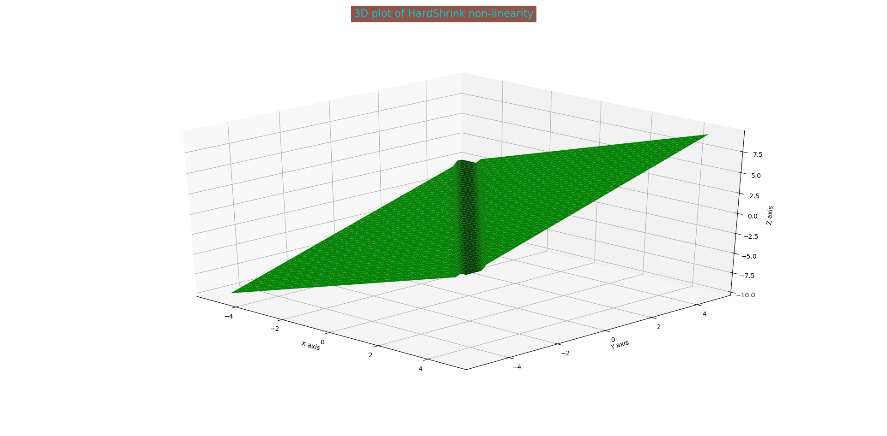

# activation-functions-3D-viz
3D visualization of common activation functions

# Sigmoid

---------------

# TanH

-------------

# ReLU

------------------

# HardShrink

--------------------------

Find many more in the script.